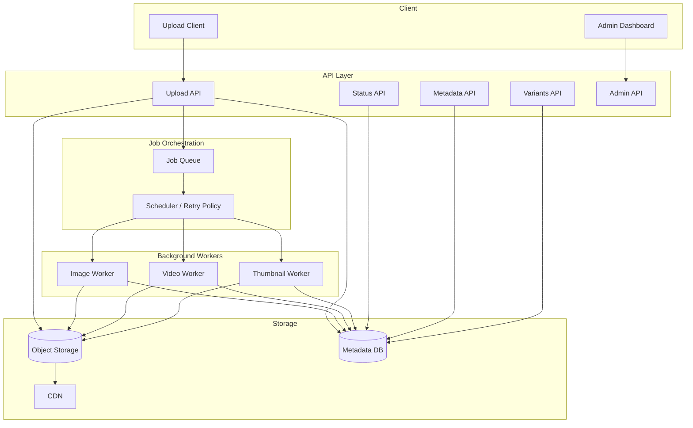

# Media Content Encoder — Implementation Plan

> **Scope:** Functional requirements FR-1 through FR-25 as provided.  
> **Note:** Non-functional requirements (NFRs) were not included in the input. Section 0 defines recommended NFRs to guide architecture and acceptance criteria. Adjust before build kickoff.

---

## 0. Recommended Non-Functional Requirements (NFRs)

These are assumed baseline NFRs for a production media pipeline. Confirm or revise with stakeholders.

| ID | Category | Requirement |
|----|----------|-------------|
| NFR-1 | Performance | Upload API responds within 500 ms (excluding file transfer time); status/metadata APIs within 200 ms p95 |
| NFR-2 | Scalability | Horizontally scalable workers; support 100+ concurrent processing jobs per worker pool |
| NFR-3 | Availability | 99.9% uptime for upload and read APIs; processing may be eventually consistent |
| NFR-4 | Durability | Zero data loss for uploaded originals; variants recoverable from originals |
| NFR-5 | Security | Authenticated upload/admin APIs; signed CDN URLs; virus/malware scan on upload (recommended) |
| NFR-6 | Privacy | No sensitive metadata in client-facing errors; audit log for admin actions |
| NFR-7 | Observability | Structured logs, metrics (queue depth, throughput, failure rate, duration), distributed tracing |
| NFR-8 | Configurability | File size limits, resolution caps, retry policy, and codec presets configurable per environment |
| NFR-9 | Idempotency | Re-upload and reprocess operations must not corrupt state or duplicate billable work |
| NFR-10 | Cost | Storage lifecycle policies; avoid generating unused variants; CDN cache headers |

---

## 1. Architecture Overview



### Suggested Technology Stack (adjust as needed)

| Layer | Options |
|-------|---------|
| API | Node.js (Fastify/Nest) or Go (Fiber/Gin) or Python (FastAPI) |
| Queue | Redis + BullMQ, RabbitMQ, or SQS |
| Image processing | Sharp (libvips), ImageMagick |
| Video processing | FFmpeg (required for FR-8–FR-12) |
| Object storage | S3-compatible (AWS S3, MinIO, GCS) |
| Metadata DB | PostgreSQL |
| CDN | CloudFront, Cloudflare, or Fastly |
| Admin dashboard | React/Next.js + metrics backend |

---

## 2. Domain Model (Core Entities)

| Entity | Purpose |
|--------|---------|
| `MediaAsset` | Original upload record (id, owner, mime, size, status, created_at) |
| `MediaMetadata` | Extracted technical metadata (width, height, duration, codec, fps, etc.) |
| `ProcessingJob` | Async job with status, retry count, error, timestamps |
| `MediaVariant` | Processed output (type, resolution, format, bitrate, storage key, CDN URL) |
| `StreamingManifest` | HLS/DASH manifest references |
| `ThumbnailSet` | Cover, preview, timeline thumbnails |

### Job Status State Machine (FR-14)

```
PENDING → QUEUED → PROCESSING → COMPLETED
                              ↘ FAILED → (retry) → QUEUED
```

---

## 3. Phased Delivery Plan

Phases are ordered by dependency and risk. Each phase ends with demoable, testable deliverables.

---

### Phase 0 — Foundation & Project Setup

**Goal:** Runnable skeleton with CI, config, and local dev environment.

| Work Item | Maps To |
|-----------|---------|
| Initialize repo structure (api, workers, shared types, infra) | — |
| Environment config (limits, retry policy, storage, CDN) | NFR-8 |
| PostgreSQL schema migrations | FR-16, FR-17 |
| S3-compatible storage integration | FR-16, FR-17, FR-18 |
| Structured logging + basic health checks | NFR-7 |
| CI pipeline (lint, test, build) | — |
| Local dev via Docker Compose (API, DB, Redis, MinIO, FFmpeg) | — |

**Exit criteria**
- [ ] Services start locally with one command
- [ ] Can write/read a test object to storage
- [ ] Database migrations apply cleanly

**Duration estimate:** 1–2 weeks

---

### Phase 1 — Upload, Validation & Metadata (MVP Ingest)

**Goal:** Accept media uploads, validate them, extract metadata, store originals.

| Work Item | Maps To |
|-----------|---------|
| Upload API (multipart/streaming) | FR-19 |
| Format validation (JPEG, PNG, WebP, AVIF, MP4, MOV, MKV, WebM) | FR-1, FR-3 |
| File size and max resolution validation | FR-3 |
| Integrity/corruption checks (magic bytes, ffprobe/sharp probe) | FR-3 |
| Metadata extraction service | FR-2 |
| Persist original asset + metadata | FR-16, FR-17 |
| Create initial `ProcessingJob` in `PENDING` | FR-13, FR-14 |
| Metadata retrieval API | FR-21 |

**API sketch**

```
POST   /v1/media              → upload + validate + store original
GET    /v1/media/:id          → metadata
GET    /v1/media/:id/status   → processing status (stub until Phase 2)
```

**Exit criteria**
- [ ] Valid image/video uploads succeed; invalid files rejected with safe errors
- [ ] Metadata persisted and retrievable
- [ ] Original file preserved in object storage

**Duration estimate:** 2–3 weeks

---

### Phase 2 — Async Processing Framework

**Goal:** Reliable background job execution with status tracking and retries.

| Work Item | Maps To |
|-----------|---------|
| Job queue integration | FR-13 |
| Worker process scaffold (image + video worker stubs) | FR-13 |
| Status transitions: PENDING → QUEUED → PROCESSING → COMPLETED/FAILED | FR-14 |
| Processing status API | FR-20 |
| Configurable retry policy (max attempts, backoff, dead-letter) | FR-15 |
| Idempotent job enqueue (reprocess-safe) | NFR-9 |
| Metrics: queue size, job duration, failure count | FR-23 (partial), NFR-7 |

**Exit criteria**
- [ ] Upload triggers queued job automatically
- [ ] Status API reflects real-time job state
- [ ] Failed jobs retry per policy; permanently failed jobs surfaced

**Duration estimate:** 2 weeks

---

### Phase 3 — Image Processing Pipeline

**Goal:** Full image variant generation, format conversion, and optimization.

| Work Item | Maps To |
|-----------|---------|
| Multi-resolution variants: 150, 320, 640, 1280, original | FR-4 |
| Aspect-ratio-preserving resize | FR-6 |
| Optional crop parameter support | FR-6 |
| Output formats: WebP, AVIF, JPEG fallback | FR-5 |
| Compression/quality tuning per variant | FR-7 |
| Store variants + processing metadata | FR-17 |
| Variant listing API | FR-22 |

**Variant matrix (per source image)**

| Variant | Max Box | Formats |
|---------|---------|---------|
| Thumbnail | 150×150 | WebP, AVIF, JPEG |
| Small | 320×320 | WebP, AVIF, JPEG |
| Medium | 640×640 | WebP, AVIF, JPEG |
| Large | 1280×1280 | WebP, AVIF, JPEG |
| Original | source | WebP, AVIF, JPEG |

**Exit criteria**
- [ ] Image upload produces all variants asynchronously
- [ ] Variants API returns URLs/keys grouped by resolution and format
- [ ] Visual quality meets agreed SSIM/quality thresholds

**Duration estimate:** 2–3 weeks

---

### Phase 4 — Video Processing Pipeline (Transcoding)

**Goal:** Multi-resolution video outputs with bitrate optimization.

| Work Item | Maps To |
|-----------|---------|
| Transcode to 240p, 360p, 480p, 720p, 1080p | FR-8 |
| Bitrate ladders per resolution | FR-9 |
| Codec selection (H.264/H.265 + AAC) | FR-9 |
| Preserve original video | FR-16 |
| Store variants + metadata (codec, bitrate, fps) | FR-17 |
| Extend variant listing API for video | FR-22 |

**Resolution targets**

| Quality | Resolution | Typical bitrate range |
|---------|------------|------------------------|
| 240p | 426×240 | 400–800 kbps |
| 360p | 640×360 | 800–1200 kbps |
| 480p | 854×480 | 1200–2500 kbps |
| 720p | 1280×720 | 2500–5000 kbps |
| 1080p | 1920×1080 | 5000–8000 kbps |

**Exit criteria**
- [ ] Video jobs produce all configured renditions
- [ ] Outputs playable and within bitrate targets
- [ ] Processing time and failure metrics captured

**Duration estimate:** 3–4 weeks

---

### Phase 5 — Adaptive Streaming & Thumbnails

**Goal:** HLS/DASH packaging, thumbnail generation, and audio handling.

| Work Item | Maps To |
|-----------|---------|
| HLS manifest generation (.m3u8) | FR-10 |
| MPEG-DASH manifest generation | FR-10 |
| Video cover thumbnail | FR-11 |
| Preview thumbnail(s) | FR-11 |
| Timeline/sprite thumbnails | FR-11 |
| Audio stream extraction | FR-12 |
| Audio normalization | FR-12 |
| Audio-only renditions | FR-12 |
| Store manifests and thumbnails | FR-17 |

**Exit criteria**
- [ ] HLS and DASH manifests validate in standard players
- [ ] Thumbnail sets generated and linked in metadata
- [ ] Audio-only outputs available where applicable

**Duration estimate:** 3 weeks

---

### Phase 6 — CDN Integration & Public Asset Delivery

**Goal:** Serve processed assets efficiently through a CDN.

| Work Item | Maps To |
|-----------|---------|
| CDN origin configuration (storage bucket) | FR-18 |
| Cache-Control and content-type headers | FR-18, NFR-10 |
| Signed URL or token-based access (if private) | NFR-5 |
| URL generation in metadata/variants APIs | FR-21, FR-22 |
| Invalidation on reprocess/delete | FR-25 |

**Exit criteria**
- [ ] Variant URLs resolve via CDN
- [ ] Cache behavior documented and tested
- [ ] Reprocess invalidates stale CDN objects

**Duration estimate:** 1–2 weeks

---

### Phase 7 — Admin Features & Operations

**Goal:** Operational visibility and lifecycle management for administrators.

| Work Item | Maps To |
|-----------|---------|
| Admin auth + role checks | NFR-5, NFR-6 |
| Monitoring dashboard: queue size, throughput, failure rate, duration | FR-23 |
| Asset reprocessing endpoint | FR-24 |
| Asset deletion (original, variants, metadata, manifests) | FR-25 |
| Audit logging for admin actions | NFR-6 |

**Admin API sketch**

```
GET    /v1/admin/metrics
POST   /v1/admin/media/:id/reprocess
DELETE /v1/admin/media/:id
```

**Exit criteria**
- [ ] Dashboard shows live operational metrics
- [ ] Reprocess regenerates variants idempotently
- [ ] Delete removes all related storage and DB records

**Duration estimate:** 2–3 weeks

---

### Phase 8 — Hardening, Performance & Production Readiness

**Goal:** Meet NFRs, security baseline, and launch readiness.

| Work Item | Maps To |
|-----------|---------|
| Load testing (upload throughput, concurrent workers) | NFR-1, NFR-2 |
| Rate limiting and abuse protection | NFR-5 |
| Input validation audit | NFR-5 |
| Error handling review (no internal details exposed) | NFR-6 |
| Backup/restore for DB; storage lifecycle rules | NFR-4 |
| Runbooks: failure recovery, queue backlog, FFmpeg OOM | NFR-7 |
| End-to-end integration tests | — |
| Production deployment (IaC, secrets, monitoring alerts) | NFR-3, NFR-7 |

**Exit criteria**
- [ ] p95 API latency targets met under expected load
- [ ] Security review passed
- [ ] On-call runbooks and alerts in place

**Duration estimate:** 2–3 weeks

---

## 4. FR Coverage Matrix

| FR | Description | Phase |
|----|-------------|-------|
| FR-1 | Asset upload | 1 |
| FR-2 | Metadata extraction | 1 |
| FR-3 | File validation | 1 |
| FR-4 | Multi-resolution images | 3 |
| FR-5 | Format conversion (WebP/AVIF/JPEG) | 3 |
| FR-6 | Aspect ratio / cropping | 3 |
| FR-7 | Image optimization | 3 |
| FR-8 | Multi-resolution video | 4 |
| FR-9 | Bitrate optimization | 4 |
| FR-10 | HLS + DASH manifests | 5 |
| FR-11 | Video thumbnails | 5 |
| FR-12 | Audio processing | 5 |
| FR-13 | Async processing | 2 |
| FR-14 | Job status tracking | 2 |
| FR-15 | Retry mechanism | 2 |
| FR-16 | Original preservation | 1 |
| FR-17 | Variant storage | 1, 3, 4, 5 |
| FR-18 | CDN integration | 6 |
| FR-19 | Upload API | 1 |
| FR-20 | Processing status API | 2 |
| FR-21 | Metadata API | 1 |
| FR-22 | Variant listing API | 3, 4 |
| FR-23 | Monitoring dashboard | 7 |
| FR-24 | Asset reprocessing | 7 |
| FR-25 | Asset deletion | 7 |

---

## 5. Milestones & Timeline Summary

| Milestone | Phases | Cumulative Estimate |
|-----------|--------|---------------------|
| **M1 — Ingest MVP** | 0, 1 | ~3–5 weeks |
| **M2 — Async pipeline live** | 2 | ~5–7 weeks |
| **M3 — Image platform complete** | 3 | ~7–10 weeks |
| **M4 — Video transcoding complete** | 4 | ~10–14 weeks |
| **M5 — Streaming-ready** | 5, 6 | ~14–18 weeks |
| **M6 — Production launch** | 7, 8 | ~18–24 weeks |

*Estimates assume 1–2 engineers. Parallelizing image (Phase 3) and video (Phase 4) work can reduce calendar time.*

---

## 6. Risks & Mitigations

| Risk | Impact | Mitigation |
|------|--------|------------|
| FFmpeg processing slow/expensive | High | Worker autoscaling; limit max input resolution/duration early (FR-3) |
| AVIF/WebP compatibility gaps | Medium | Always emit JPEG fallback (FR-5) |
| Large file upload failures | Medium | Chunked/resumable uploads; direct-to-storage presigned upload |
| Storage cost growth | Medium | Lifecycle rules; generate only requested variant profiles |
| Job duplication on retry | High | Idempotency keys; deterministic output paths per asset+variant |
| CDN stale content after reprocess | Medium | Versioned paths or explicit cache invalidation |

---

## 7. Testing Strategy (Per Phase)

| Phase | Test Focus |
|-------|------------|
| 1 | Validation unit tests; metadata golden files; corrupt file rejection |
| 2 | Job state machine; retry/backoff; concurrency |
| 3 | Pixel dimensions; aspect ratio; format output; quality benchmarks |
| 4 | Transcode correctness; bitrate bounds; long-video soak tests |
| 5 | Manifest validation (hls.js, dash.js); thumbnail coverage |
| 6 | CDN cache headers; URL signing expiry |
| 7 | Admin RBAC; delete completeness; reprocess idempotency |
| 8 | Load tests; chaos tests (worker crash mid-job) |

---

## 8. Open Decisions (Resolve Before Phase 1)

1. **Auth model:** API keys, JWT, OAuth — affects all APIs (FR-19–FR-22, FR-23–FR-25)
2. **Upload pattern:** Direct upload through API vs presigned URL to storage
3. **Max limits:** Max file size, max resolution, max video duration
4. **Cropping API:** Query param vs dedicated transform endpoint
5. **Private vs public assets:** Signed CDN URLs vs public bucket
6. **NFR confirmation:** Validate assumed NFRs in Section 0 with stakeholders
7. **Cloud target:** AWS, GCP, Azure, or self-hosted (drives CDN/storage choices)

---

## 9. Suggested Repository Layout

```
media-content-encoder/
├── apps/
│   ├── api/                 # REST API (upload, status, metadata, variants, admin)
│   ├── worker-image/        # Image processing worker
│   ├── worker-video/        # Video/ffmpeg worker
│   └── admin-dashboard/     # Monitoring UI
├── packages/
│   ├── shared/              # Types, validation schemas, constants
│   └── storage/             # S3 client, path conventions
├── infra/                   # Terraform/Pulumi, Docker Compose
├── docs/
│   └── api/                 # OpenAPI specs
└── scripts/                 # Local dev, seed data, ffmpeg helpers
```

---

## 10. Definition of Done (Global)

A phase is complete when:

1. All mapped FRs for that phase are implemented and traceable in the matrix above
2. Automated tests cover critical paths
3. APIs documented (OpenAPI)
4. Metrics and logs emitted for operational visibility
5. Configuration externalized (no hardcoded limits or secrets)
6. Demo recorded or staging environment updated

---

*Document version: 1.0 — Generated from FR-1 through FR-25.*
